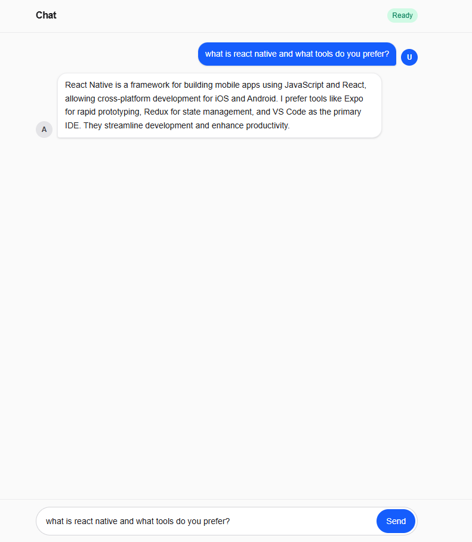
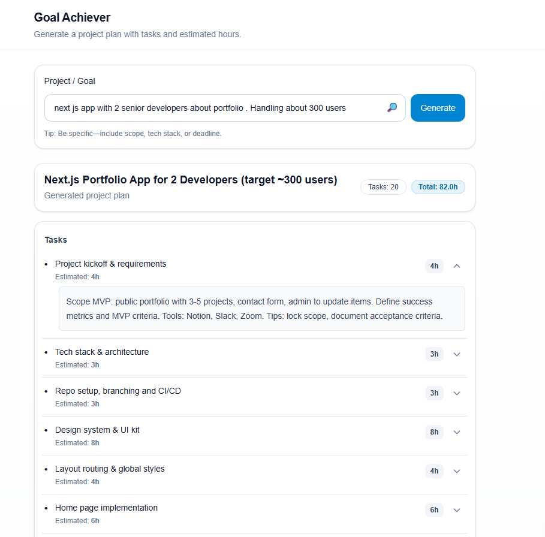
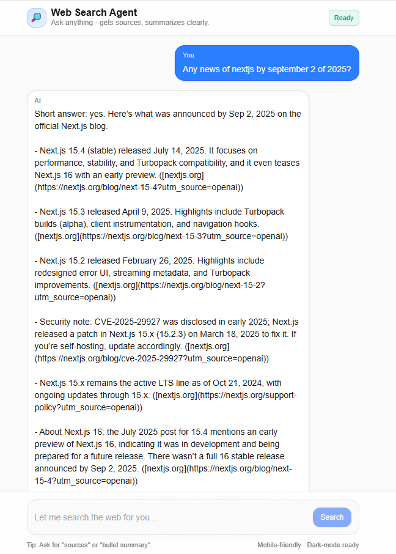

# AI Super Agent

All your AI utilities, one clean home.  
Jump into voice, image generator, text, chat, structured JSON, image & PDF analysis.

To run the application

1) Git clone https://github.com/leandrosdim/ai-agent

2) In the project folder run npm install

3) If you dont have already create an OpenAI API KEY. Copy-Paste it to an .env file in the root folder of the project like this:

OPENAI_API_KEY="your api key"

4) Run command npm run dev and visit http://localhost:3000

## Screenshots

### Home Page
The Home Page serves as the central hub of the app, giving users quick access to all AI utilities in a clean, modern layout. 
It highlights the main features like Voice Chat, Chat bot, Project Management bot, Image Generation, and more, each presented as separate tiles for easy navigation. Designed mobile-first, it ensures a smooth experience across devices with a unified interface and bottom tab bar for quick switching.

### Voice Chat Bot
The Voice Agent page enables real-time, push-to-talk conversations with the AI. Users can hold a button to speak, receive instant voice responses, and even see a visualizer indicating when the AI is talking. It also offers controls to adjust voice style, speaking speed, and live instructions for a more personalized experience.

### Chat Bot
The Chat Bot page provides a clean, responsive interface for multi-turn conversations with the AI. Messages are displayed in a chat-style layout with user and assistant bubbles, complete with typing indicators for a natural feel. A bottom input bar makes it easy to send new prompts or stop responses mid-stream, ensuring smooth and interactive dialogue.

### AI Project Management
The Project Management page helps you generate structured project plans from a single goal or idea. It breaks down projects into clear tasks with estimated hours, offering details and total time calculations for better planning. Users can expand tasks for more context, see conclusions, and use the tool as a lightweight project planner powered by AI.

### Image Generator
The Image Studio page allows users to transform text prompts into AI-generated images with just a few clicks. It offers prompt suggestions, aspect ratio and style options, and a smooth mobile-first design. Results can be regenerated, downloaded, or revisited through a recent history strip, making experimentation fast, creative, and user-friendly.

### PDF && Image Analysis
The Multi-Modal Chat Bot page extends conversations beyond text by allowing users to upload PDFs and images. The AI can summarize, extract tables, or describe visuals directly in the chat flow, displaying previews of uploaded files alongside responses. This makes it a powerful tool for analyzing documents and images interactively, combining chat flexibility with file understanding.

### AI Currency Converter
The Currency Converter page demonstrates how AI can integrate with external API tools in real time. Instead of only answering with text, the assistant detects conversion requests, calls the underlying API, and streams structured results back into the conversation. This showcases the app’s ability to extend AI responses with live data from external services, making it a clear example of practical API-tool integration.

### AI Web Search Agent
The Web Search Agent page integrates real-time web browsing into the app, letting users ask questions that require up-to-date answers. Instead of relying only on the model’s memory, it fetches live results, summarizes them clearly, and provides source links for verification. The interface shows progress indicators for search states and is optimized for mobile use with a clean, dark-mode-friendly design.

### Text Generator (One shot answers)
The Text Generator page delivers quick, one-shot answers to user prompts without multi-turn conversation. It’s designed for short, direct queries where the user simply types a question or statement and instantly gets a clear response. This makes it ideal for fast explanations, summaries, or single-use text generation tasks.
